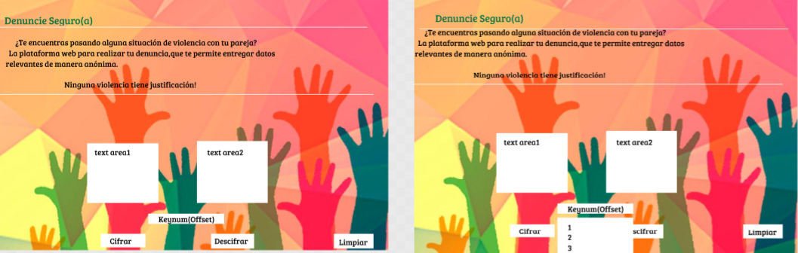
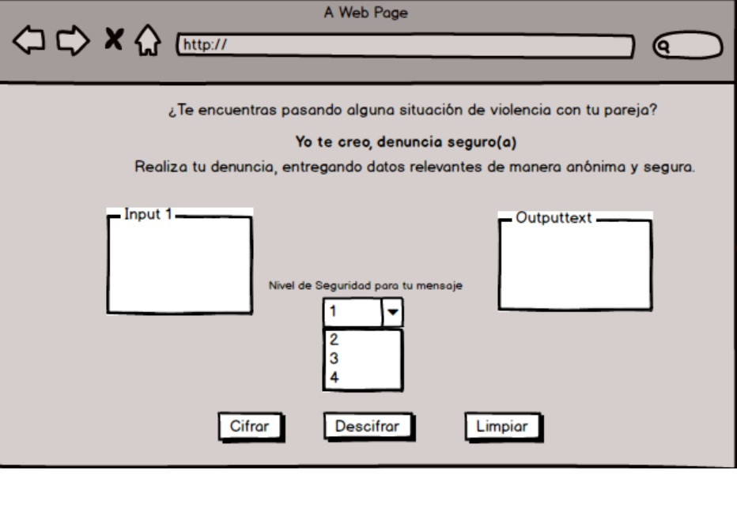
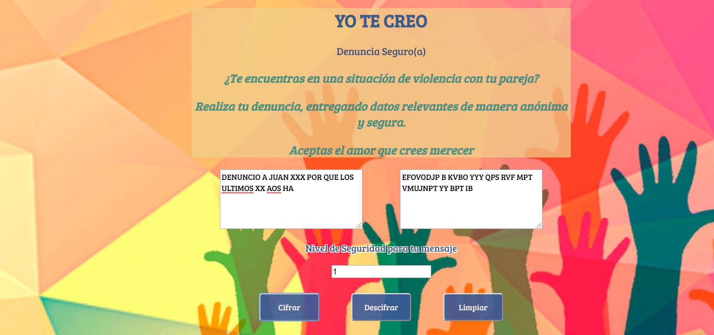
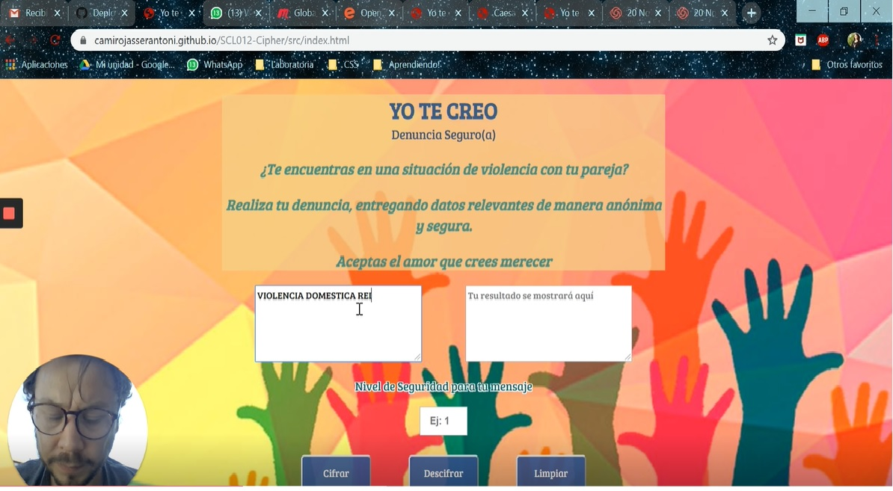
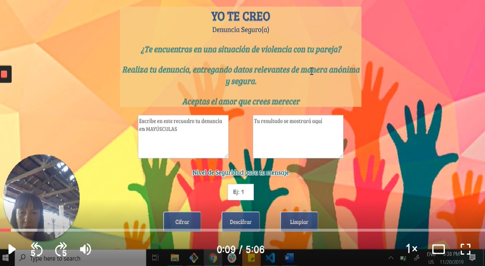

# YO TE CREO, Denuncia Seguro(a)

## Victimas y testigos de Violencia de Género              
 👫👬👭

La definición más aceptada acerca del concepto de Violencia de Género es la propuesta por la Organización de las Naciones Unidas, en el año 1995 la que indica;

>Todo acto de Violencia sexista que tiene como resultado posible o real un daño físico, sexual o psíquico, incluidas las amenazas, la coerción o la privación arbitraria de libertad, ya sea que ocurra en la vida pública o privada.

A modo general, la asimetría de poder de un género por sobre otro ampara las diferencias y valida el desarrollo de conductas que merman tanto psicológica o físicamente a su compañero(a). 

En opinión de Tomás Honorato, director ejecutivo de Fundación Honra (dedicada apromover la equidad de género y la no violencia en pareja); 

> “La violencia tiene indudablemente un componente de género, donde 1 de cada 3 mujeres en nuestro país sufre violencia, versus 1 caso registrado durante el año pasado en que un hombre fue víctima de violencia por parte de su pareja".

Considerando las diversas maneras de hacer pareja (convivencia, acuerdo de unión civil, pololeo y/o  matrimonio, entre otros) es posible dar cuenta que al momento de encontrarnos en una situación de violencia de manera indistinta al género el cual nos reconozcamos, solemos tener dificultades al momento de decidir o no denunciar situaciones de maltrato. 

Las razones para dilatar la presentación de una denuncia por maltratos físicos, psicológicos o sexuales responden principalmente al miedo de la víctima, quienes generalmente no cuenta con las redes de apoyo de cercanos; la dependencia económica, baja autoestima y creencias en torno al maltrato (tales como "me lo merezco", "yo lo(a) provoqué" o "le he hecho enfadar luego es mi culpa", entre muchas otras).

 Por otro lado por parte de los testigos de violencia, suele callar por miedo a las consecuencias y/o posibles represalias. 

 ## ¿Cómo YO TE CREO ayuda a quienes se encuentran en una situación de Violencia? 🙌

Yo te creo, funciona como una aplicación web que ofrece a las personas, tanto victimas cómo testigos de violencia (independientemente del género al cual se identifiquen),  una alternativa que les permita denunciar de manera  anónima  y amigable. En tal sentido, como organización nos preocupamos de resguardar la información del(a) denunciante, por lo cual no se encuentra como requisito al momento de generar su denuncia la entrega de datos personales y no queda registro desde dónde genera su solicitud. 

Pretendemos mitigar el temor de revelar información clave y de acuerdo a la gravedad del relato, generar conexiones con organizaciones, redes de apoyo-de no contar con la propia- que lo(a) contengan y le permitan una solución a la situación. En esta plataforma, tanto la  víctima cómo el testigo puede escribir todo lo que ha vivenciado con certeza de que nadie lo leerá, con la seguridad visual del cifrado y la posesión de la clave de seguridad, necesaria para descifrarlo.

## Proceso de diseño y prototipado🎨
La interfaz de usuario inicial de **Yo te creo** es bastante sencilla. Tiene una pantalla centrada cuya parte superior contiene los espacios de input de textos y el cifrado, escogiendo el nivel de seguridad y la opción que requiera al escoger en la parte inferior, donde se encuentran los botones. 

 ** Aún no me encuentro satisfecha con el resultado actual **, pero preferí enfocar los esfuerzos en la funcionalidad de la página, para en futuras iteraciones agregar el contenido extra que permita mayor interactividad y resuleva de manera útil las necesidades del(a) usuario(a).

## Qué es el Cifrado César? 🔐

El [cifrado César](https://en.wikipedia.org/wiki/Caesar_cipher) es uno de los primeros métodos de cifrado conocidos. El emperador romano Julio César lo usaba para enviar órdenes secretas a sus generales en los campos de batalla.

El cifrado césar es una de las técnicas más simples para cifrar un mensaje. Es un tipo de cifrado por sustitución, es decir que cada letra del texto original es reemplazada por otra que se encuentra un número fijo de posiciones (desplazamiento) más adelante en el mismo alfabeto.

Por ejemplo, si usamos un desplazamiento de 3 posiciones:

- La letra A se cifra como D.
- La palabra CASA se cifra como FDVD.
- Alfabeto sin cifrar: A B C D E F G H I J K L M N O P Q R S T U V W X Y Z
- Alfabeto cifrado: D E F G H I J K L M N O P Q R S T U V W X Y Z A B C

### Prototipos 📄

La imagen de fondo, fue escogida debido a que si bien contiene colores, estos no se ajustan a un género en particular y dan cuenta de diferentes manos, refiriendo a la diferencia y a que quienes levantan estas manos tienen algo que decir, tal como los usuarios para los cuales está pensada la aplicación web.  

posteriormente, de acuerdo al feedback obtenido por el equipo el diseño tuvo algunos cambios de estructura, de modo que permita una organización más intuitiva para el usuario(a).  

Lo que llevado a Código finalmente tuvo este resultado,cuyas modificaciones surgen a partir de la necesidad de integrar mayor información acerca del funcionamiento de la aplicación a los usuarios, siendo más intuitivo su uso.  

Respecto a los colores aplicados,   en primer lugar cabe reconocer que los aplicados a las fuentes así como el de fondo, se caracterizan de acuerdo a principios de color del marketing,  en integrar los colores preferidos tanto de hombres cómo de mujeres. 

Con ello, fueron pensados en la diversidad de posibles usuarios(as), debido a que no apuntan a una edad o un sector en particular, sino que busca integrar a la diversidad de género y facilitar además, la comprensión del uso de la misma, por eso posicionar cada parte del cuerpo de la aplicación de manera centrada y de modo que cada paso de esta, se muestre de manera progresiva a través de su uso. 

Por otro lado, la decisión de colocar el **color azul**  tanto al título y cómo a los botones,fue pensada de acuerdo a la sensación que este provoca, que de acuerdo a principios de  marketing y psicología del color, podemos considerar que el color azul, provoca la sensación de confianza y cercanía, necesarias para que el usuario se sienta cómodo con su uso. . 

El efecto hover de los botones que cambia a **verde**, fue considerado al estimar que este color connota ideas como "amigable", seguridad y  medio ambiente, que dado a su amplio uso en los semáforos, sugiere la idea de *ir*  o el *movimiento hacia adelante*.

## Herramientas y lenguaje utilizado 🛠
* HTML 5
* CSS3
* JS

## Iteración con Usuarios(as)
Esta iteración permitió conocer la experiencia de usuarios reales en la usabilidad de la aplicación, quienes me comentaron la necesidad de realizar algunos cambios que permitan una mayor comprención en el uso de la aplicación. 

## Planificación ⏱
Para gestionar de una manera eficiente el tiempo con el que contamos, utilizamos Trello que conjuntamente con los Daily y el continuo feedback del squad permitieron ajustarnos a los tiempos estimados. 
